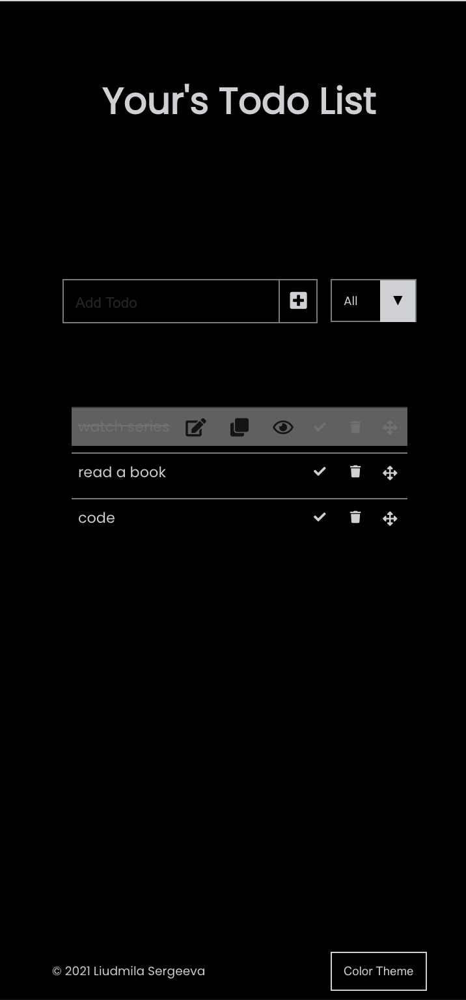
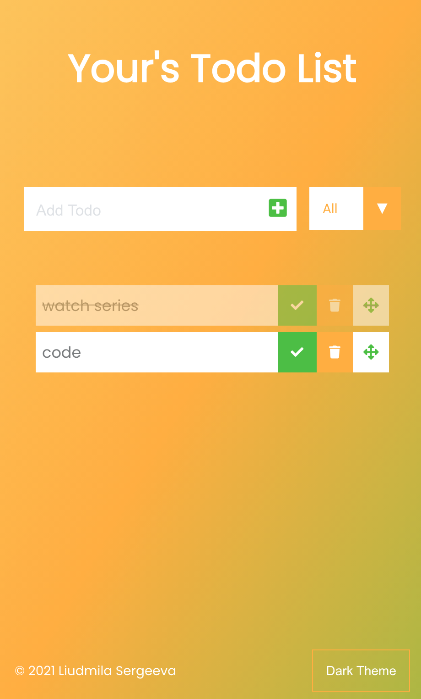

# Project: To do list

---

## Description

 
A Vanilla JavaScript Todo App. You can use the input field to enter the title of a new task and add that task to the list by either clicking the check icon or hitting return. It is possible to sort tasks as completed or uncompleted. Change theme of the app (color/dark). Orange your tasks (drag and drob). View and edit current tasks. Data saved in Local Storage.

### :arrow_right: Links to test

 
https://milasergeeva.github.io/to_do_vanillaJS/

## :hammer_and_pick:Technologies

 
The following tecnologies were used to create this project:

- HTML

- CSS

- JaveScript

### Preview

 
 

 
 
